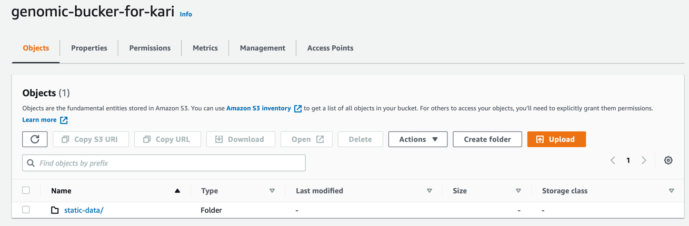
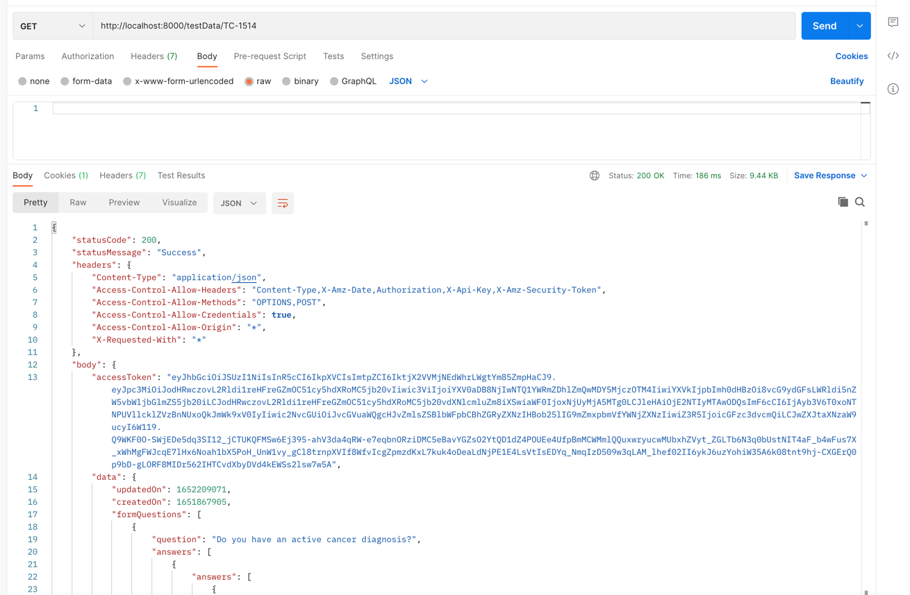

1. Go to S3 in your AWS account and create a bucket with name `any_unique_name`
2. Upload the `static-data` folder to this bucket.
Note: Do this manually using AWS Management Console now, later you can do this using Github actions

Example: I created a bucket named 'genomic-bucker-for-kari' and uploaded the 'static-data' folder you sent me:



3. Modify the .env file in this repo  with:
```
ACCESS_SECRET={your_aws_secret_key} 
ACCESS_KEY={your_aws_access_key} 
REGION=us-east-1
BUCKET={any_unique_name} 
```

4. Run the express server
```
 node app.js
```

5. Test that it is working by using postman
Example: GET the data for TC `TC-1514` using
```
http://localhost:8000/testData/TC-1514
```
